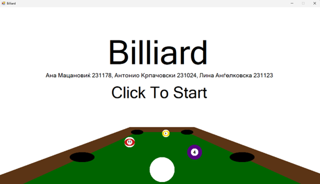
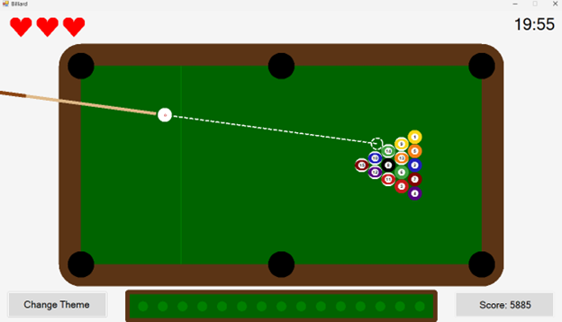
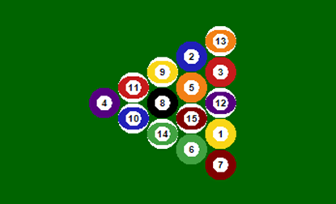
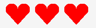

# Билјард

Windows Forms Проект изработен од: Ана Мацановиќ 231178, Антонио Крпачовски 231024, Лина Анѓелковска 231123.

# 1\. Oпис на Апликацијата

Во нашиот Windows Forms проект направивме симулација на познатата игра Билјард. Го користевме системот за цртање на Windows Forms за да ги претставиме топките, масата, почетниот екран и екранот за крај на игра.

# 2\. Упатство за користење

## 2.1. Започнување на нова игра

При отворање на апликацијата најпрво ќе се прикаже почетниот екран. За да започнете со играта треба да кликнете на екранот. На почетокот на секоја игра ќе треба да ја поставите белата топка. При првото поставување може да се постави само на првата четвртина од масата.

## 2.2. Користење на палката

Откако ќе се постави топката со движење на глувчето се одредува насоката во која ќе се движи топката. При држење на клик палката се повлекува наназад. Колку подолго се држи толку посилен ќе биде ударот врз белата топка која отпосле ќе оди во одбраната насока.

## 2.3. Целта на играта

Целта на играта е сите топки да бидат внесени, со тоа што топката со број 8, односно црната топка, да биде внесена последна.

## 2.4. Поени

Во играта има поени. Поените се пресметуваат како:

преостанатото време \* 3 + број на внесени топки \* 200 + број на животи \* 1000 + бонус поени

бонус поени се 0 при загуба и 2000 при победа.

## 2.5. Правила

- На почетокот на секоја игра имате 3 животи. Доколку белата топка влезе во дупка, се губи 1 живот, на 0 животи играта завршува со загуба.

- На почетокот на секоја игра белата топка може да биде поставена само на првата четвртина од масата. Отпосле доколку топката е падната, може да се постави било каде на масата сѐ додека нема колизија со работ, друга топка или дупка.

- Доколку црната топка влезе пред сите топки да бидат внесени, играта завршува со загуба.

- Доколку црната и белата топка бидат внесени истовремено, играта завршува со загуба.

- Во играта има тајмер што одбројува од 20 минути. Доколку истече, играта завршува со загуба.

- Доколку последна биде внесена црната топка и белата топка е сѐ уште на масата, играта завршува со победа.

# 3\. Претставување на проблемот

## 3.1. Податочни структури

За претставување на играта користиме неколку класи:

- Scene, каде се чуваат променливите според кои се цртаат објектите.

- Hole, каде се чуваат потребните аргументи за цртање на дупка.

- Ball, каде се чуваат податоци за цртање на топка, боите на топките, дали се паднати или не и нивната позиција.

## 3.2. Алгоритми

### 3.2.1. Алгоритам за поставување на топките

Во функцијата “populate()” користиме една точка “TopLeft” според која ги позиционираме остатокот од топките. Оставаме 3 пиксели простор помеѓу сите топки, и ги распределуваме во форма на триаголник користејќи вгнездени for циклуси. Црната топка 8 има секогаш иста позиција, додека остатокот од топките се избираат со помош на Random променлива.

### 3.2.2. Алгоритам за цртање на масата

За цртање на масата се користи функцијата “DrawTable(Graphics g)”. Најпрво наоѓаме низа од точки кои ги претставуваат аглите на масата. За работ на масата користиме 8 точки намсето 4 со тоа што се креира правоаголник со засечени агли. Кај аглите цртаме кругови за да добиеме заоблен изглед кругови и да добиеме заоблен облик. Врз кафеавата форма за рабовите, се црта зелен правоаголник кој ја означиува средината на масата. Потоа од оригиналните 4 точки, ги наоѓаме средишните точки на долгата страна од масата за поставување на дупките. На крај се исцртува линија која одделува една четвртина од масата.

### 3.2.3. Алгоритам за цртање на палка

За цртање на палка ја користиме функцијата “DrawCue(Graphic g, Point mousePos)”. Најпрво ја селектираме белата топка и ја ставаме во променлива “cueBall”. Отпосле го пресметуваме растојанието од белата топка до позицијата на курсорот по X и по Y оските, па преку Питагорина теорема го пресметуваме растојанието. Го наоѓаме аголот помеѓу нив, а палката се исцртува во спротивната насока. Растојанието од палката до топката се зголемува зависно од колку долго го држиме кликот. Од топката се исцртува испрекината линија која покажува кон каде таа ќе се движи. Линијата се црта од топката првиот објект со кој топката има колизија користејќи го аголот помеѓу топката и курсорот. За проверка на колизија се користи “GhostBall” променлива која претставува транспарентна помала топка исцртана со испрекинати линии. “GhostBall” започнува од позицијата на белата топка па продолжува да се движи по зададениот агол и застанува при првиот судир со објект.

### 3.2.4. Функција за удирање на белата топка

За удирање на белата топка користиме функција “Strike(Point mousePos)”. Исто како во цртањето на палката, го наоѓаме аголот од топката кон курсорот, и отпосле задаваме сила во зависност од тоа колку долго палката се повлекувала. Отпосле силата се пренесува на белата топка преку “Velocity” атрибутите.

### 3.2.5. Функција за движење на топките

За движење на топките користиме функција “Move()”. Во оваа функција секоја топка се поместува за нејзините “Velocity” атрибути и губи дел од тој атрибут како резултат на триенје со коефициент 0.02. Насоката на движење се одредува според позитивен или негативен “Velocity”. Доколку центарот на топката влезе во дупка, топката излегува од игра. Доколку топката дојде до работ, нејзиниот соодветен “Velocity” атрибут се множи со -1.

### 3.2.6. Функција за колизија на топките

За колизија на топките се користи функцијата “HandleBallCollisions()”. Функцијата ги изминува сите парови на топки, исклучувајќи ги паднатите. Доколку топките имаат колизија една со друга, тогаш нивните “Velocity” атрибути се одзимаат и секоја топка продолжува во своја насока.

Тука беше користена генеративна вештачка интелигенција. Користејки го ChatGPT го прашавме “Како топките да не се заглавуваат и залепуваат една во друга”. Ни помогна со додавање на “overlap” и “Corelation” атрибути кои овозможија пореалистична физика при колизија на топките.

### 3.2.7. Функција за завршување на играта

За завршување на играта користиме функција “CheckGameOver(bool timeFlag)” која проверува сите услови за завршување на играта:

- Тајмерот да биде истечен.

- Црната топка да не биде внесена последна.

- Црната и белата топка да бидат внесени истовремено.

- Корисникот да победи со тоа што ќе ја внесе црната топка последна пред да истече тајмерот.

- Корисникот да ги изгуби сите животи.

# 4\. Користење на генеративна вештачка интелигенција

Деловите каде е користена Вештачка интелигенција се наведени во коментари во кодот, сѐ останато е напишано од нас.

## 4.1. Константна големина на прозорец

Се консултиравме со ChatGPT за начин да направиме константна големина на прозорец, кое ни беше потребно за да не се прават проблеми со позициите на топките. Ни помогна да го откриеме атрибутот “this.MaximizeBox” со што ни се реши проблемот.

## 4.2. Цртање на срца

Со помош на ChatGPT ја создадовме функцијата “DrawHearts()” која користи прецизни фигури за да создаде срца кои отпосле ги користиме за да означиме преостанати животи

## 4.3. Функција за колизија на топките

Се искористи за 2 атрибута кој ни помогнаа да ја направиме физиката пореалистична. Подетално е објаснето во 3.2.6.

## 4.4 Центрирање на текстот на топките

Се искористи при правење на топките за наоѓање на центарот со интерес бројќите да бидат во средина.

SizeF textSize = g.MeasureString(stringNumber, f);

